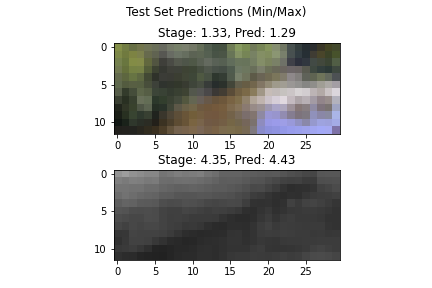
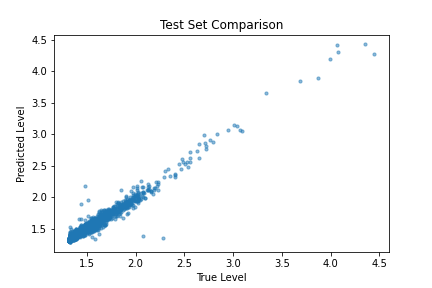

# River Level Model

This project provides the utilities to fetch USGS river camera imagery and build a Convolutional Neural Network to predict river level based on imagery.

Ingest is performed by a `Metaflow` flow.

Training uses Pytorch.

# Setup

TODO

# Ingest Data

Data is pulled from USGS webcams. The current hardcoded site location seems to be down now.

Pull data with `python ingestflow.py`

# Training

A messy training script is `train_reg.py`. This also was used to generate the figures below.

# Results

