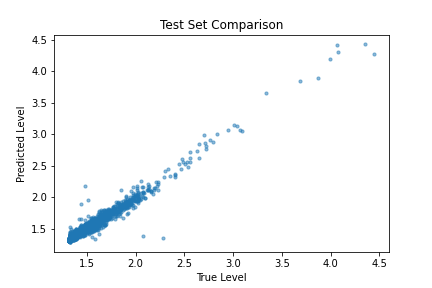

# River Level Model

This project provides the utilities to fetch USGS river camera imagery and build a Convolutional Neural Network to predict river level based on imagery.

Both ingest and training are managed by a `Metaflow`.

# Setup

TODO

# Ingest Data

Data is pulled from USGS webcams. The current hardcoded site location seems to be down now.

Pull data with `python ingestflow.py run`

# Training

Training is performed by calling `python trainflow.py run`

Call `python trainflow.py run --help` to view available command line parameters.

By default the model, metrics, and validation plots are saved to the `runs/run_{datetime.now()}` directory.
This directory is created if it does not exist.

# Results

