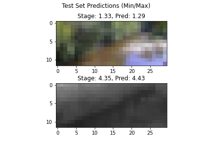

# River Level Model

This project provides the utilities to fetch USGS river camera imagery and build a Convolutional Neural Network to predict river level based on imagery.

Ingest is performed by a `Metaflow` flow.

Training uses Pytorch.

# Setup

TODO

# Results

